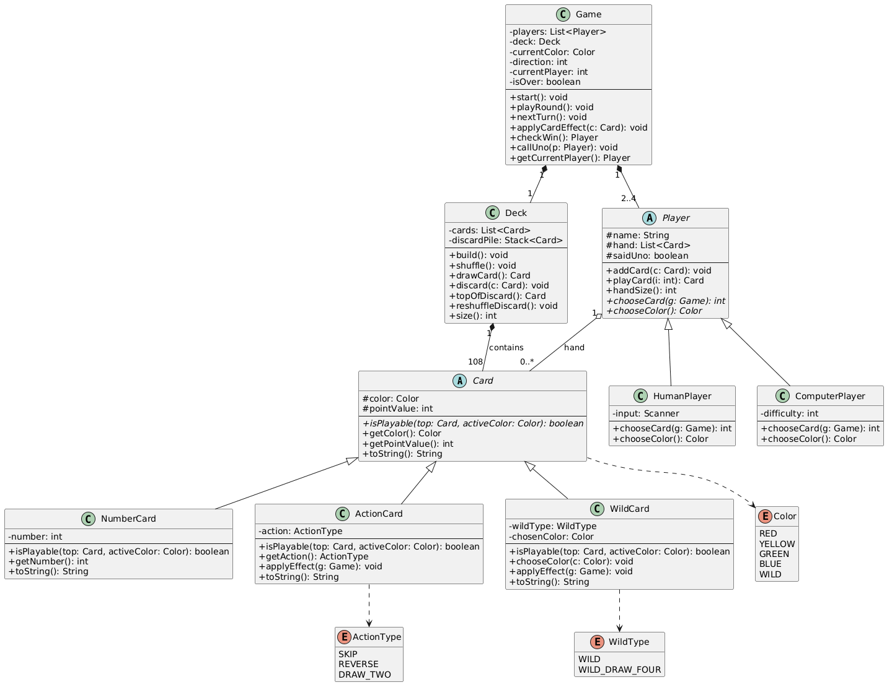

# UNO – Project Proposal

## Team Members

- Raja Hussain (rh4472@nyu.edu)
- Simon Ames (swa8451@nyu.edu)

## Game Description

We're building a Java version of UNO that runs in the terminal. It supports 2 to 4 players, and any of those slots can be a person or a basic AI opponent. The game follows the standard UNO rules, including action cards, wild cards, and direction reversal.

## Planned Features

- A full 108-card UNO deck (76 number cards, 24 action cards, 8 wild cards)
- 2 to 4 players, mixing humans and computer opponents
- Cards match by color or by number/symbol
- Action cards: Skip, Reverse, and Draw Two
- Wild cards: Wild (lets you change the color) and Wild Draw Four
- Turn order can flip between clockwise and counter-clockwise
- Players draw from the deck if they don't have a playable card
- The discard pile gets reshuffled into the draw pile when the deck runs out
- "UNO" call enforcement: if you forget to call it when you're down to one card, you pick up a penalty card
- Command-line interface that shows your hand and the current game state each turn

## Objectives and Win/Loss Conditions

The first player to get rid of all their cards wins the round. Everyone else loses since they're left holding cards. Strategy mostly comes down to when you play your action and wild cards. You want to hold them until they actually disrupt the next player, and you want to keep track of how many cards your opponents have left, especially after someone calls UNO.

## Class Design

### `Card` (abstract)

- **Attributes:** `color: Color`, `pointValue: int`
- **Methods:**
  - `isPlayable(top: Card, activeColor: Color): boolean`
  - `getColor(): Color`
  - `getPointValue(): int`
  - `toString(): String`

### `NumberCard extends Card`

- **Attributes:** `number: int` (0–9)
- **Methods:** `isPlayable(...)`, `getNumber(): int`, `toString()`

### `ActionCard extends Card`

- **Attributes:** `action: ActionType`
- **Methods:** `isPlayable(...)`, `getAction(): ActionType`, `applyEffect(g: Game): void`, `toString()`

### `WildCard extends Card`

- **Attributes:** `wildType: WildType`, `chosenColor: Color`
- **Methods:** `isPlayable(...)`, `chooseColor(c: Color): void`, `applyEffect(g: Game): void`, `toString()`

### `Deck`

- **Attributes:** `cards: List<Card>`, `discardPile: Stack<Card>`
- **Methods:** `build()`, `shuffle()`, `drawCard(): Card`, `discard(c: Card)`, `topOfDiscard(): Card`, `reshuffleDiscard()`, `size(): int`

### `Player` (abstract)

- **Attributes:** `name: String`, `hand: List<Card>`, `saidUno: boolean`
- **Methods:** `addCard(c: Card)`, `playCard(i: int): Card`, `handSize(): int`, `chooseCard(g: Game): int`, `chooseColor(): Color`

### `HumanPlayer extends Player`

- **Attributes:** `input: Scanner`
- **Methods:** `chooseCard(g: Game): int`, `chooseColor(): Color`

### `ComputerPlayer extends Player`

- **Attributes:** `difficulty: int`
- **Methods:** `chooseCard(g: Game): int`, `chooseColor(): Color`

### `Game`

- **Attributes:** `players: List<Player>`, `deck: Deck`, `currentColor: Color`, `direction: int` (+1 or -1), `currentPlayer: int`, `isOver: boolean`
- **Methods:** `start()`, `playRound()`, `nextTurn()`, `applyCardEffect(c: Card)`, `checkWin(): Player`, `callUno(p: Player)`, `getCurrentPlayer(): Player`

### Enums

- `Color { RED, YELLOW, GREEN, BLUE, WILD }`
- `ActionType { SKIP, REVERSE, DRAW_TWO }`
- `WildType { WILD, WILD_DRAW_FOUR }`

## UML Relationships

- `NumberCard`, `ActionCard`, and `WildCard` all inherit from `Card`.
- `HumanPlayer` and `ComputerPlayer` both inherit from `Player`.
- A `Deck` is made up of 108 `Card` objects (composition).
- A `Player` holds 0 or more `Card` objects in their hand (aggregation).
- A `Game` contains exactly one `Deck` (composition).
- A `Game` contains 2 to 4 `Player` objects (composition).
- `Card` uses the `Color` enum, `ActionCard` uses `ActionType`, and `WildCard` uses `WildType`.

## UML Diagram



## Project Structure

All Java source files live at the repo root for simple `javac *.java` compilation.

```
UNO/
├── README.md
├── UML.png
├── UNO_Proposal.pdf
├── .gitignore
├── GameLauncher.java     [Hussain]
├── Game.java             [Hussain]
├── Card.java             [Simon]
├── NumberCard.java       [Simon]
├── ActionCard.java       [Simon]
├── WildCard.java         [Simon]
├── Color.java            [Simon]
├── ActionType.java       [Simon]
├── WildType.java         [Simon]
├── Deck.java             [Simon]
├── Player.java           [Hussain]
├── HumanPlayer.java      [Hussain]
└── ComputerPlayer.java   [Hussain]
```

## Responsibilities and Deadlines

### Simon Ames — backend (data layer)

- The `Card` class hierarchy (`Card`, `NumberCard`, `ActionCard`, `WildCard`) and the `Color`, `ActionType`, `WildType` enums
- The `Deck` class: build, shuffle, draw, discard, reshuffle
- `isPlayable` validation logic for each card subclass
- Unit tests for the card classes
- **First draft due:** Wednesday, May 13, 2026

### Raja Hussain — backend (game engine) / client / user

- The `Game` class: turn loop, direction tracking, active color tracking
- Action card effect routing (Skip, Reverse, Draw Two) and wild card resolution
- Win condition logic and UNO call enforcement
- `GameLauncher` (main entry point)
- Game-level tests
- The `Player` class hierarchy (`Player`, `HumanPlayer`, `ComputerPlayer`)
- A simple AI for `ComputerPlayer` (play first valid card, pick most-held color)
- Console display: hand rendering, game-state rendering, prompts, winner screen
- Input parsing for `HumanPlayer` (card selection, color choice, UNO call)
- **First draft due:** Wednesday, May 13, 2026

Each person writes tests for their own module. We run the full end-to-end playthrough together at the final meeting before submission.

## Group Meetings

The semester ends mid-May and the final is due 5/19, so we're meeting roughly twice a week to fit four meetings in.

| #   | Date              | Focus                                                            |
| --- | ----------------- | ---------------------------------------------------------------- |
| 1   | Sun, May 10, 2026 | Kickoff: agree on class interfaces and split up the work         |
| 2   | Wed, May 13, 2026 | Review first drafts and connect `Card` and `Deck` with `Player`  |
| 3   | Sun, May 17, 2026 | Bring in the `Game` engine and run the first end-to-end test     |
| 4   | Mon, May 18, 2026 | Final polish, bug fixes, and demo dry run before 5/19 submission |

**Default:** in person at a Bobst study room.  
**Backup:** Zoom.  
**Day-to-day coordination:** a shared GitHub repo and a group chat.
